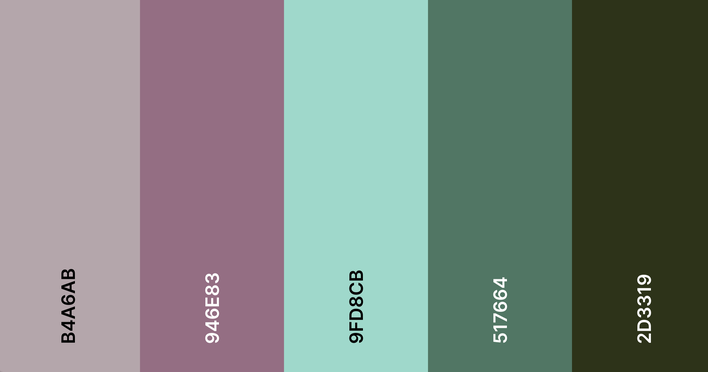

# Adulting
#### For all the stuff you can't remember when you did it last... (call your mom)

## Project Links

- [github repo link](https://github.com/scwdev/adulting-frontend)
- [deployment link](https://adulting.vercel.app/)

## Project Description
An interactive "to-do" list app where users can input tasks with full CRUD functionality. In addition, the user can specifiy how often each task "should" be completed, and the app will prioritise overdue tasks.

### Wireframe/Architecture

- [wireframe](https://app.moqups.com/UibAumEbX3/view/page/ad64222d5)
- [architecture](https://app.moqups.com/JZARfVe4Tx/view/page/ad64222d5)

### Additional Resources:
#### Affirmation API
- https://affirmations-dev.herokuapp.com/ (https://github.com/annthurium/affirmations)
#### Colour Palette:

- #2D3319
- #517664
- #9FD8CB
- #946E83
- #B4A6AB

<<<<<<< HEAD
##### Form Builder
https://react-hook-form.com/form-builder

=======
## Time Table

| Component | Priority | Estimated Time | Time Invested | 
| --- | :---: |  :---: | :---: |
| Planning (Wireframe, Architecture, Timetable) | H | 3 hrs| | 
| Set up Backend API Mongoose/Heroku | H | 2 hrs |  |
| CRUD routes for Users/Tasks | H | 3 hrs|  |
| Setup React Components/Pages| H | 5 hrs|  |
| Create React Routes | M | 2 hrs|  |
| Styling | L | 6 hrs| |
| Total | H |  21 hrs| |
>>>>>>> 2bef3701108fa287b31807ca79026a5ede096ae6
